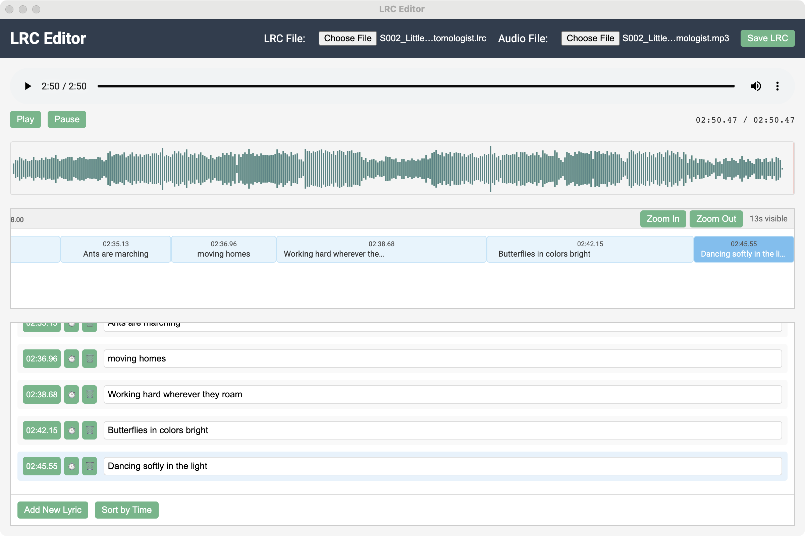

# LRC Editor

A visual timeline-based editor for LRC (Lyrics) files, allowing you to synchronize lyrics with audio tracks. Perfect for creating karaoke files, music videos, or dubbing projects.



## Features

- **Visual Timeline Editing**: Drag and drop lyrics on a timeline similar to video editing software
- **Audio Waveform Display**: Visualize audio patterns to easily identify words and timing
- **Variable-width Lyric Blocks**: See the duration each lyric is displayed
- **Real-time Preview**: Lyrics highlight during playback
- **Zoom Controls**: Adjust timeline scale for precise timing
- **Import/Export**: Load and save standard LRC files
- **Keyboard Shortcuts**: Speed up your workflow

## Installation

### Download Pre-built Versions

You can download the latest release for your platform:
- macOS: `LRC-Editor-mac.dmg`
- Windows: `LRC-Editor-win.exe`
- Linux: `LRC-Editor-linux.AppImage`

### Run from Source

If you prefer to run from source:

```bash
# Clone the repository
git clone https://github.com/yourusername/lrc-editor.git
cd lrc-editor

# Install dependencies
npm install

# Start the application
npm run serve
```

## Usage Guide

### Getting Started

1. **Load an Audio File**: Click "Audio File" button to load your MP3 or other audio format
2. **Load an Existing LRC File** (optional): Click "LRC File" to load existing lyrics
3. **Add Lyrics**: Click "Add New Lyric" to begin adding synchronized lyrics

### Editing Lyrics

- **Add Timing**: Position the playhead and click the ⏱️ button next to a lyric
- **Edit Text**: Click on any lyric text to edit its content
- **Move Lyrics**: Drag lyrics on the timeline to adjust timing
- **Delete Lyrics**: Click the 🗑️ button to remove a lyric

### Timeline Navigation

- Use the zoom buttons to adjust the timeline scale
- Click on the waveform to jump to a specific position
- The active lyric is highlighted during playback

### Saving Your Work

- Click "Save LRC" to export your synchronized lyrics as an LRC file
- The exported file can be used with media players that support LRC format

## Build Instructions

To build the application from source:

```bash
# Install dependencies
npm install

# Create production build
npm run build-app
```

This will create packaged applications in the `dist_electron` directory.

## Technical Details

- Built with Vue.js 2
- Uses HTML5 Audio API for playback
- Implements WaveSurfer.js for audio visualization
- Packaged with Electron for cross-platform compatibility

## Contributing

Contributions are welcome! Please feel free to submit a Pull Request.

## License

This project is licensed under the MIT License - see the LICENSE file for details.

---

*LRC Editor is a tool for creating and editing LRC files and is not affiliated with any music streaming service or media player.*